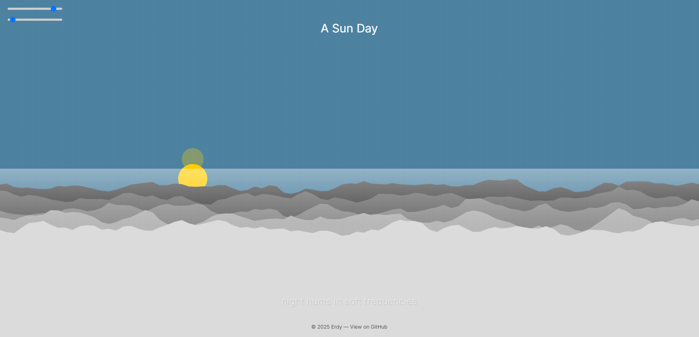

# A Sun Day ☀️🌙  
*A meditative generative landscape coded in p5.js*

[🌐 View Live](https://sunday.erdry.com) | [🧑‍💻 View Source](https://github.com/erdry/a-sun-day)

---

## 🌄 Overview

**A Sun Day** is a generative art sketch that visualizes the calm rhythm of nature — a slow sunrise and sunset over mountainous terrain, accompanied by ambient tones and shifting poetry. Built with **p5.js**, this piece is part of my creative coding portfolio to explore how code can create emotion.

The project combines:
- Animated day–night cycles
- Randomized generative mountains
- Poetic lines that follow the time of day
- Ambient sound generated algorithmically
- UI sliders to control pace and terrain
- Elegant minimal UI with subtle textures

---

## 🎨 Features

- 🌅 Smooth, endless **sun/moon animation**
- 🏔️ **Procedural mountain** layers with random seed variation
- 🌟 Night **stars and reflections**
- 🎚️ Controls for **speed** and **mountain reshaping**
- ✍️ Generative **poetry** line fades tied to time
- 🔉 **Ambient sound** using sine oscillator + reverb
- 🌐 Responsive layout & mobile-friendly controls
- 💡 Elegant **UI design** and minimalist aesthetic

---

## 🛠️ Built With

- [p5.js](https://p5js.org/) — Creative coding library for visuals and interactivity
- [p5.sound](https://p5js.org/reference/#/libraries/p5.sound) — Audio generation and reverb
- [Google Fonts: Inter](https://fonts.google.com/specimen/Inter) — UI typography

---

## 📸 Screenshot



> Want to try a different look? Change the seed, slow the time, or wait until night...

---

## 🚀 How to Use

To run locally:

```bash
git clone https://github.com/yourusername/a-sun-day.git
cd a-sun-day
# Open index.html in your browser
